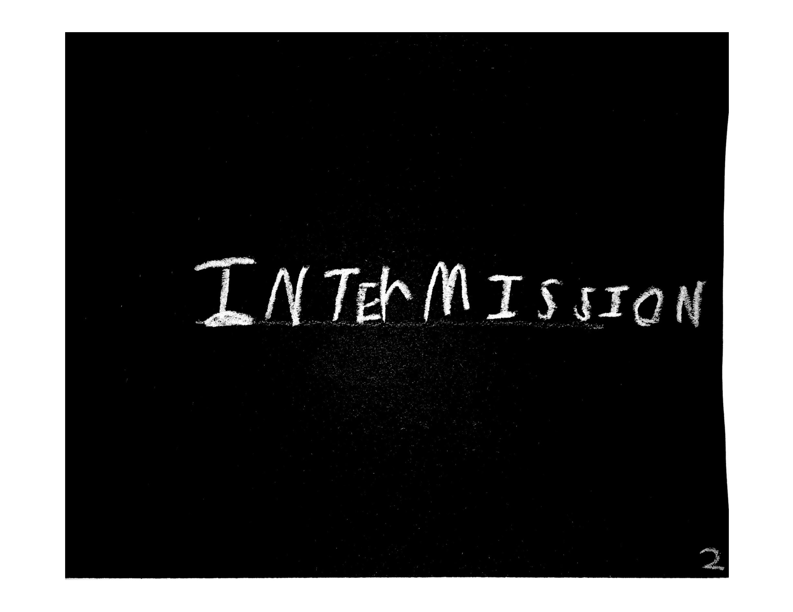

# How to Convert the PDF to Source Content for an Online Book

This guide will help you convert `The book that can read your mind Gray Edition.pdf` into source files for generating an online book in HTML, EPUB, and PDF formats.

## Steps

1. **Extract Images from PDF**
   - Use a tool like `pdfimages` (Linux) or `ImageMagick` to extract each page as an image.
   - Example (Linux):
     ```bash
     pdfimages -png 'The book that can read your mind Gray Edition.pdf' page
     # Or with ImageMagick:
     convert -density 300 'The book that can read your mind Gray Edition.pdf' page_%03d.png
     ```

2. **Process and Crop Images**
   - Move or copy the extracted images into an `orig/` folder for safekeeping.
   - Create a `mod/` folder for your modified images.
   - Review the images in `orig/` for quality and consistency.
   - To determine the ideal dimensions for your final images:
     - Open several images from `orig/` in an image viewer or editor and inspect their dimensions (width x height).
     - Choose a consistent size that fits your target format (e.g., for print, 1200x1600 pixels is common; for screens, you may want 1080x1440 or similar).
     - Consider the aspect ratio of your book (e.g., A5, US Letter, etc.) and match the images to that ratio.
     - If you want to automate this, you can use `identify` from ImageMagick to list dimensions:
       ```bash
       identify orig/*.png
       ```
   - Use `mogrify` to crop and resize images from `orig/` and save them to `mod/`:
     ```bash
     mogrify -path mod/ -crop WxH+X+Y -resize 1200x1600 orig/*.png
     ```
   - Adjust `WxH+X+Y` and `1200x1600` to your chosen dimensions.

3. **Build New PDF, EPUB, or HTML Book**
   - Always use images from the `mod/` folder for publishing.
   - Output all generated files to a `dist/` folder.
   - Combine the processed images into a new PDF using `img2pdf`, `ImageMagick`, or similar tools:
     ```bash
     img2pdf mod/*.png -o dist/new-book.pdf
     # Or with ImageMagick:
     convert mod/*.png dist/new-book.pdf
     ```
   - For EPUB/HTML, create a simple HTML file with each image as a page (using images from `mod/`), then use `pandoc` or `ebook-convert` (from Calibre) to convert:
     ```html
     <!-- dist/index.html -->
     <html><body>
     
     
     <!-- ... -->
     </body></html>
     ```
     ```bash
     ebook-convert dist/index.html dist/new-book.epub
     pandoc dist/index.html -o dist/new-book.epub
     pandoc dist/index.html -o dist/new-book.pdf
     ```

4. **Review and Edit**
   - Check the output files for formatting issues, image quality, and page order.
   - Adjust image dimensions or order as needed and rebuild.

## Recommended Tools
- [pdfimages](https://linux.die.net/man/1/pdfimages) (extract images from PDF)
- [ImageMagick](https://imagemagick.org/) (crop/resize images, build PDF)
- [img2pdf](https://github.com/josch/img2pdf) (combine images into PDF)
- [Calibre](https://calibre-ebook.com/) (for EPUB editing)
- [Pandoc](https://pandoc.org/) (for HTML/EPUB conversion)

## Notes
- No OCR is needed since the content is images.
- Cropping and resizing may be required for consistent page dimensions.
- For EPUB/HTML, each image can be a page; add alt text if desired.

Feel free to ask for automation scripts or help with any step!
